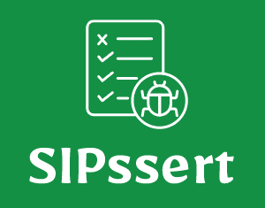
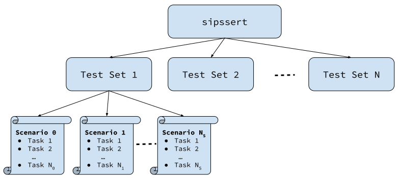

# SIPssert Testing Framework

SIPssert Testing Framework is a tool used for facilitating the automation and
testing of complex VoIP setups, that involve multiple types of components and
various interactions between them. Its purpose is to provide a set of
components that can be easily scripted (through [YAML](https://yaml.org/)
files) and orchestrate them in order to run, test/check their behavior and
provide troubleshooting information to the goal of validating that a setup is
running correctly for a particular set of defined scenarios. In a nutshell,
SIPssert is a framework able to execute a set of tasks and check whether their
execution lead to an expected behavior, defined in a scenario.

The framework relies on the [Docker](https://www.docker.com/) engine to manage
the execution of different tasks that a scenario may require. Each task is an
abstraction of a [Docker](https://www.docker.com/) container that controls the
execution a specific component within the scenario (such as an
[OpenSIPS](https://www.opensips.org) server, a
[SIPp](https://sipp.sourceforge.net/), etc.).

It is written in [Python](https://www.python.org/) and has a modular design,
allowing you to run as a task any application that can be dockerized in a
container. In order to facilitate and ease the scripting of a specific
component, you can easily enhance the framework with a new task type by
extending the [Task](framework/tasks/task.py) interface.

Although the framework was initially created for defining and
testing SIP setups, it can easily run any generic scenarios/setups.

## Functionality

### Structure

The SIPssert Testing Framework has a hierarchical structure, illustrated below:


 * At the top level, is the main `sipssert` application; at this level you can
tune a set of run parameters (such as logging settings); you can find
[here](docs/config/run.md) more information on the configuration file.
The application requires one or more **tests sets** to run. The `sipssert`
application starts the engine controller, which then runs each **tests set**.
 * Each **tests set** provided as parameter represents a directory which
consists of multiple **scenarios**; it may also contain a
[`config.yml`](docs/config/tests-set.md) file and
[`define.yml`](docs/config/define.md) file that can tune information about a
specific test set.
 * A **scenario** is a directory within a test set that contains all the
requirements to run a certain scenario to test: application configuration
files, provisioning data, and probably the most important, the [scenario
description](docs/config/scenario.md) YAML file; the scenario file contains
multiple **tasks**.
 * A **task** is the lowest entity of the framework, but probably the most
important; it is the abstraction of a docker container that contains the entire
logic a specific component of the test is performing. More information on this
can be found in the [Tasks](#tasks) section.

### Execution

The execution of the `sipssert` application consists of running and testing
the tests sets passed as parameter. Each set of tests (or scenarios) is run
sequentially. Moreover, each scenario within a tests set is run sequentially
(one-by-one) as well.

An optional set of tasks can be executed at the beginning and at the end of
each tests set. These tasks can be defined using the `init_tasks` and
`cleanup_tasks` in the [Tests Set Configuration](docs/config/tests-set.md)
file. Note that if any of the tasks within the `init_tasks` list fails, the
scenarios for the tests set are no longer run, and the tests set is considered
as failed.

A scenario consists of a set of tasks; all the tasks within the set are
implicitly run in parallel, however this behavior can be controlled through
[Tasks Dependencies](docs/dependencies.md). Similarly to tests set, each
scenario can have a set of init and cleanup tasks; when used, all init tasks
are run (in parallel) before running the scenario's tasks. If any of the init
tasks fails, the scenario is no longer run and considered failed. If used,
cleanup tasks are run (again, all in parallel) after all the scenarios tasks
complete.

Running a task is equivalent with running a Docker container, with the
properties and settings defined in the task's [definition](#tasks). When
running a task set of a scenario, if one of the task is failed, all the
subsequent tasks, that have not been started yet, are no longer executed. The
exception is the cleanup tasks, that are executed all the time (since their
status is not even accounted for).

### Testing

The result of the testing is derived from the status of the task: the exit code
of the container running the task; if the exit code is `0`, the task is
considered successful, otherwise failed.

A scenario is considered successful if all its tasks, including the init ones,
if present, have finished with successful codes. Cleanup tasks statuses are
never considered.

### Isolation

As each task is executed in its own docker container, the application run
within the task has limited access to its environment/OS, just as a regular
docker container execution would be. For example, a task would not have access
to the hosts file system. However, in order to facilitate access to shared
information, when running a scenario, each task has the entire scenario
directory mounted as a read-only directory. This way it can access any
configuration files defined for the scenario on the host.

### Networking

In terms of networking, scenarios/tests sets can be run in two different modes:
 * `host` - tasks running with this network can access the entire host's
networks; check more on [Docker host
network](https://docs.docker.com/network/host/)
 * `bridge` - a custom, isolated LAN, where all tasks can talk to each other,
but can only be reachable from external with explicit port forwarding; check
more on [Docker bridge network](https://docs.docker.com/network/bridge/)
You can find more information about networking in the [Tests Set
Configuration](docs/config/tests-set.md) description.

### Troubleshooting

Troubleshooting incidents of a specific testing run can be done at multiple
levels, from logging to network inspection. More information about this can be
found in the [Troubleshooting](docs/troubleshooting.md) page.

### Logging

By default, the SIPssert Testing Framework logs at standard output only the
progress of the testing: the scenario that is being run along with their
statuses. However, it can be tuned to display more information about internal
events, as well as application logs. More information can be found in the
[Logging](docs/logging.md) page.

## Tasks

Tasks are the abstraction of a docker container, and their purpose is to
simplify the configuration and execution of the application the are executing,
by providing simple to use settings that can tune their behavior.
You can find more information about task [here](docs/tasks.md).

The current tasks types available in the framework are
 * [OpenSIPS](docs/tasks/opensips.md): Runs OpenSIPS SIP Server
 * [OpenSIPS CLI](docs/tasks/opensips-cli.md): Executes commands using the
[OpenSIPS CLI](https://github.com/OpenSIPS/opensips-cli) tool
 * [OpenSIPS MI](docs/tasks/opensips-mi.md): Executes MI commands using the
[Python OpenSIPS](https://github.com/OpenSIPS/python-opensips) module
 * [SIPp](docs/tasks/sipp.md): Runs [SIPp](https://sipp.sourceforge.net/)
scenarios
 * [UAC SIPp](docs/tasks/uac-sipp.md): Executes a
[SIPp](https://sipp.sourceforge.net/) User Agent Client scenario
* [UAC SIPp Stir and Shaken](docs/tasks/uac-sipp-stir-shaken.md): Executes a
[SIPp](https://sipp.sourceforge.net/) User Agent Client for Stir and Shaken scenarios
 * [UAS SIPp](docs/tasks/uas-sipp.md): Executes a
[SIPp](https://sipp.sourceforge.net/) User Agent Server scenario
* [SipExer](docs/tasks/sipexer.md): Executes a 
[SipExer](https://github.com/miconda/sipexer) User Agent, including WebRTC scenarios
 * [Asterisk](docs/tasks/asterisk.md): Runs an Asterisk PBX
 * [AMI Client](docs/tasks/ami-client.md): Executes an Asterisk AMI Client
 * [OSS API](docs/tasks/oss-api.md): Runs a command using the OpenSIPS Solutions
API
 * [MySQL client](docs/tasks/mysql-client.md): Runs a MySQL Client
 * [MySQL](docs/tasks/mysql.md): Runs a MySQL Server
 * [PostgreSQL](docs/tasks/postgresql.md): Runs a PostgreSQL Server
 * [RTPProxy](docs/tasks/rtpproxy.md): Runs RTPProxy Media Proxy Server
 * [Sleep](docs/tasks/sleep.md): Sleeps for a certain amount of time
 * [Generic](docs/tasks/generic.md): Runs a generic task/container

## Installation

### Prerequisites

 * `python3-docker` library for controlling the Docker engine

### Install

Clone the repository and navigate to it's content, then run:
```
python3 setup.py install --user clean
```
for a local user install, or
```
sudo python3 setup.py install
```
for a system wide install.

## Usage

In order to run a test suite, simply run the `sipssert` tool, followed by the
tests set directory. Example:
```
sipssert /home/tests/opensips
```

The tool supports multiple tests sets passed as arguments, and will run each
tests set sequentially (see [Execution](#execution)).

The SIPssert tool also accepts as parameters the following values:
* `-h|--help` - used to display information about running `sipssert`
* `-l|--logs-dir DIR` - directory where the logging files should be stored (Default
is `logs/`)
* `-c|--config CONFIG` - [Run Configuration](docs/config/run.md) file (Default
is `run.yml')
* `-t|--test [SET/]TEST` - pattern that specifies which scenarios/tests should
be run; if `SET` is specified, only tests within that test set are being matched
* `-e|--exclude [SET/]TEST` - similar to `-t/--test`, but specifies the tests
that should be excluded from the execution; if both include and exclude match
a test, the test will not be run
* `-n|--no-delete` - do not delete the resources after run (**NOTICE**: you
will have to manually delete both containers and networks)
* `-x|--no-trace` - do not trace call
* `-v|--version` - prints the current version

### Scenarios
The SIPssert Testing Framework provides a simple way of defining testing
scenario through [YAML](https://yaml.org/) files. You can find more information
about running scenarios [here](docs/guide/scenarios.md).

### Local Testing
In order to run `sipssert` without installing it, you have to export the
`PYTHONPATH` variable to the root of the `sipssert` package. If you are in
the root of the project, simply do:

```
export PYTHONPATH=.
bin/sipssert path/to/tests/set
```

Note that running the tool might require priviledged access, thus you may want
to run the tool using sudo (as oposed to running it as `root`); to do that, you
need to preserve the `PYTHONPATH` variable while lifting the privileges:

```
sudo -E env PYTHONPATH=. bin/sipssert path/to/tests/set
```
Alternatively, configure sudo to bypass the `PYTHONPATH` variable: add in the
`/etc/sudoers.d/python` (or directly in `/etc/sudoers`) the following line:
```
Defaults env_keep += "PYTHONPATH"
```
Then run the application using sudo:
```
sudo bin/sipssert path/to/tests/set
```

## Guidelines

* [Write Scenarios](docs/guide/scenarios.md)

## Configuration Files:
 * [Run Configuration](docs/config/run.md)
 * [Tests Set Configuration](docs/config/tests-set.md)
 * [Defines Configuration](docs/config/define.md)
 * [Scenario Definition](docs/config/scenario.md)

## Contribute

Feel free to contribute to this project with any Task, or functionality you
find useful by opening a pull request.

## License

<!-- License source -->
[License-GPLv3]: https://www.gnu.org/licenses/gpl-3.0.en.html "GNU GPLv3"
[Logo-CC_BY]: https://i.creativecommons.org/l/by/4.0/88x31.png "Creative Common Logo"
[License-CC_BY]: https://creativecommons.org/licenses/by/4.0/legalcode "Creative Common License"

The `sipssert` source code is licensed under the [GNU General Public License v3.0][License-GPLv3]

All documentation files (i.e. `.md` extension) are licensed under the [Creative Common License 4.0][License-CC_BY]

![Creative Common Logo][Logo-CC_BY]

© 2023 - OpenSIPS Solutions
